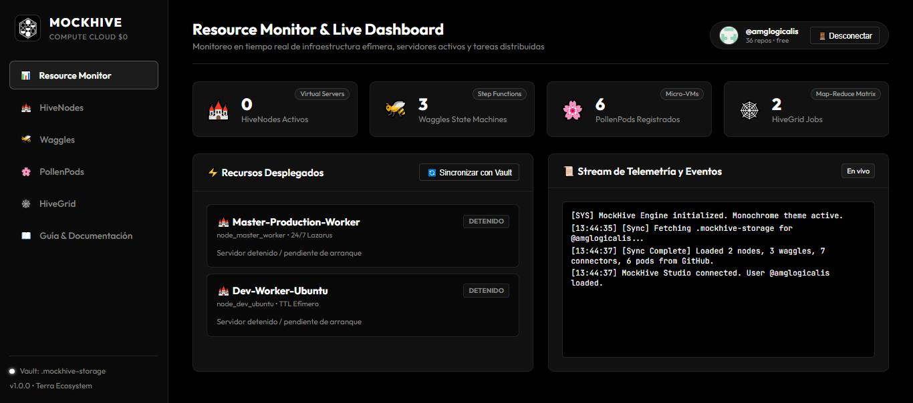

# 🐝 MOCKHIVE

<p align="center">
  
</p>

<p align="center">
  <strong>The $0 Cost Compute Cloud, Virtual Ubuntu Servers, State Machines & Distributed Map-Reduce Engine for the Terra Ecosystem</strong><br>
  <em>Zero Subscription Cost • 100% Private Client-Side Architecture • 6h GitHub Actions Compute • Web Terminal & SSH Relays • Polyglot Functions • Multi-Tier Reduction Tree</em>
</p>

<p align="center">
  <a href="https://amglogicalis.github.io/mockhive-repo-public/" target="_blank">
    
  </a>
  <a href="https://www.npmjs.com/package/terra-mockhive" target="_blank">
    
  </a>
</p>

<p align="center">
  
  
  
  
  
  
</p>

---

## 🖥️ Vista Previa de la Consola Web (MockHive Studio)

<p align="center">
  <a href="https://amglogicalis.github.io/mockhive-repo-public/" target="_blank">
    
  </a>
</p>

<p align="center">
  👉 <strong><a href="https://amglogicalis.github.io/mockhive-repo-public/">Abrir Consola Web Interactiva Online</a></strong> (Cero instalación, compatible con GitHub PAT)
</p>

---

## 📑 Tabla de Contenidos

1. [🌟 Visión General y Arquitectura $0](#-visión-general-y-arquitectura-0)
2. [📦 Instalación y Puesta en Marcha](#-instalación-y-puesta-en-marcha)
3. [🏰 1. HiveNodes: Servidores Virtuales y Terminal SSH](#-1-hivenodes-servidores-virtuales-y-terminal-ssh)
4. [🐝 2. Waggles: State Machines y Orquestación de Flujos](#-2-waggles-state-machines-y-orquestación-de-flujos)
5. [🌸 3. PollenPods: Funciones Serverless Polyglot](#-3-pollenpods-funciones-serverless-polyglot)
6. [🕸️ 4. HiveGrid: Cluster Distribuido Map-Reduce](#️-4-hivegrid-cluster-distribuido-map-reduce)
7. [📦 5. Estrategias de Almacenamiento y Data Lake](#-5-estrategias-de-almacenamiento-y-data-lake)
8. [💻 6. Referencia Completa del CLI y SDK](#-6-referencia-completa-del-cli-y-sdk)
9. [💡 7. Buenas Prácticas y Restricciones de Uso](#-7-buenas-prácticas-y-restricciones-de-uso)
10. [❓ 8. Preguntas Frecuentes (FAQ)](#-8-preguntas-frecuentes-faq)

---

## 🌟 Visión General y Arquitectura $0

**MockHive** es la plataforma de infraestructura cloud serverless y distribuida del ecosistema **Terra**. Convierte la potencia de cómputo gratuita de los runners de GitHub Actions en una nube de cómputo integral con **coste económico \$0** y sin necesidad de contratar proveedores tradicionales:

```
                                 🐝 MOCKHIVE ENGINE
                              (Control Plane Desacoplado)
                                         │
    ┌──────────────────┬─────────────────┼─────────────────┬──────────────────┐
    ▼                  ▼                 ▼                 ▼                  ▼
🏰 HIVENODES        🐝 WAGGLES        🌸 POLLENPODS     🕸️ HIVEGRID        📦 STORAGE VAULT
(Servidores Ubuntu) (State Machines)  (Micro-Handlers)  (Map-Reduce Swarm) (Snapshots / Rolla)
    │                  │                 │                 │                  │
    └──────────────────┴─────────────────┼─────────────────┴──────────────────┘
                                         ▼
                            🖥️ MOCKHIVE STUDIO (SPA)
                   (Web Terminal xterm.js & Resource Monitor)
```

### Principios Fundamentales:
* **🔒 100% Privado y en tu Propia Cuenta:** No existe ningún servidor central o backend propietario. La consola web se ejecuta en el navegador y dialoga directamente mediante TLS con la API de GitHub.
* **⚡ Cero Facturas Mensuales:** Emplea los minutos de GitHub Actions y el alojamiento estático en GitHub Pages.
* **💾 Persistencia Agnóstica:** Guarda estados y snapshots en repositorios Git (`.mockhive-storage`), almacenamiento inmutable Rolla (`rolla://`) o buckets compatibles con AWS S3 / Cloudflare R2.

---

## 📦 Instalación y Puesta en Marcha

### 1. Instalación Global del CLI:
```bash
npm install -g terra-mockhive
```

### 2. Inicialización del Entorno Local:
```bash
mockhive init
```

### 3. Levantar la Consola Web Local:
```bash
# Puerto por defecto (7440)
mockhive console

# O en un puerto personalizado con cualquiera de sus aliases
mockhive console --port 8080
mockhive serve --port 8080
mockhive studio --port 8080
```

### 4. Uso Programático con TypeScript / ES Modules:
```typescript
import { MockHive } from 'terra-mockhive';

const hive = new MockHive({
  storageRepo: '.mockhive-storage'
});

await hive.init();

// Listar servidores virtuales
const nodes = await hive.listNodes();
console.log(`Servidores activos: ${nodes.length}`);
```

---

## 🏰 1. HiveNodes: Servidores Virtuales y Terminal SSH

Un **HiveNode** es una máquina virtual Ubuntu 24.04 LTS completa (2 vCPU, 7 GB RAM, 14 GB SSD) ejecutada sobre runners de GitHub Actions con persistencia de archivos en `/mockhive/data`.

### Modos de Conexión Interactiva:
1. **🌐 Web Terminal en Navegador (Recomendada):** Acceso directo interactivo (*xterm.js*) con colores ANSI, soporte para copiar/pegar y permisos de `sudo` sin instalar clientes adicionales.
2. **💻 SSH Nativo por Puerto 443:** Encapsula el tráfico SSH a través de Cloudflare Tunnel para eludir bloqueos en routers domésticos y firewalls corporativos:
   ```bash
   ssh runner@mockhive-nodo.trycloudflare.com
   ```
   *Contraseña por defecto:* `mockhive2026` (o la configurada en el formulario).

### Ciclo de Vida y Gestión de Minutos:
* **⏱️ Modo TTL Efímero (Recomendado):** El servidor se auto-apaga tras $N$ minutos o tras un periodo de inactividad SSH. Ideal para desarrollo y tareas puntuales.
* **🔄 Modo 24/7 Lazarus Relay:** Antes de alcanzar el límite de 6 horas de GitHub Actions, el servidor empaqueta `/mockhive/data` en un snapshot comprimido `.tar.zst`, lanza un runner relevo y traspasa la sesión de forma continua. *(Úsalo responsablemente respetando los ToS de GitHub)*.

### Comandos del CLI para HiveNodes:
```bash
# Crear un servidor virtual
mockhive nodes create --name "Dev-Worker" --lifecycle ttl_ephemeral --ttl 120 --storage vault_persistent --tunnel tmate

# Listar servidores registrados
mockhive nodes list

# Iniciar servidor y abrir conexión
mockhive nodes start <nodeId>

# Conectar por SSH desde terminal
mockhive nodes ssh <nodeId>

# Detener servidor
mockhive nodes stop <nodeId>
```

---

## 🐝 2. Waggles: State Machines y Orquestación de Flujos

Las **Waggles** son el orquestador declarativo de flujos de trabajo de MockHive, compatible con el estándar ASL (Amazon States Language) para definir grafos de ejecución dirigidos (DAGs).

### Capacidades Destacadas:
* **Tipos de Estados Soportados:** `Task`, `Choice` (bifurcaciones condicionales `eq`, `gt`, `contains`), `Wait`, `Pass`, `Succeed`, `Fail` y `WaitForCallback`.
* **⏸️ Aprobaciones Human-in-the-Loop:** Pausa la ejecución en puntos críticos y genera un token de aprobación para reanudar el pipeline desde la consola web o el CLI.
* **🔌 Conectores Reutilizables:**
  * **HTTP:** Integración universal con APIs REST, GraphQL o webhooks con soporte para Bearer Token y API Keys.
  * **Storage:** Lectura y escritura directa en Rolla Balls, AWS S3 o el Vault de GitHub.
  * **Code / Pod:** Ejecución de micro-transformadores en JavaScript, Python o Bash.

### Modos de Ejecución:
* **🌐 Modo Navegador (`client_browser`):** Ejecución instantánea (0 ms) en el motor JavaScript local. Ideal para probar lógica y bifurcaciones sin consumir minutos de CI.
* **☁️ Modo Cloud Runner (`cloud_runner`):** Despacho a un runner de Ubuntu real en GitHub Actions con acceso completo al sistema de archivos, Docker y conectividad externa.

```bash
# Crear máquina de estados
mockhive waggles create --name "Order-Processing-DAG" --file ./waggle.json

# Ejecutar pipeline con contexto
mockhive waggles run <waggleId> --context '{"orderId": 1042, "amount": 150}'

# Reanudar pipeline en espera de aprobación humana
mockhive waggles resume <execId> --approve
```

---

## 🌸 3. PollenPods: Funciones Serverless Polyglot

Los **PollenPods** son micro-funciones compiladas bajo demanda para tareas atómicas y procesamiento sin estado.

### Runtimes Disponibles:
| Runtime | Versión | Entorno |
| :--- | :--- | :--- |
| **Python** | 3.11 | Con soporte para `pip`, pandas, numpy |
| **Node.js** | 20 LTS | JavaScript y TypeScript nativo |
| **Rust** | 1.78 | Compilación nativa de máximo rendimiento |
| **Go** | 1.22 | Binarios ultra-ligeros de alta concurrencia |
| **WASM** | WebAssembly | Sandbox aislado con arranque en microsegundos |
| **Bash** | POSIX Shell | Automatización de scripts de sistema |

### 3 Vías de Invocación Externa:
1. **Localmente vía CLI / SDK:** Ejecución síncrona con reporte de latencia en milisegundos.
2. **Endpoint HTTP en HiveNode:** Servidor express/fastapi levantado en un nodo activo para llamadas REST públicas (<50 ms latencia).
3. **Serverless Asíncrono vía GitHub Dispatches:** Disparo mediante `POST /repos/:owner/:repo/dispatches` a coste \$0.

```bash
# Crear un Pod
mockhive pods create --name "Data-Transformer" --runtime python3 --handler ./handler.py

# Invocar Pod con payload JSON
mockhive pods invoke <podId> --payload '{"items": ["a", "b"], "multiplier": 3}'
```

---

## 🕸️ 4. HiveGrid: Cluster Distribuido Map-Reduce

**HiveGrid** permite ejecutar procesamiento masivo de datos dividiendo datasets entre **2 y 20 runners simultáneos** en GitHub Actions.

```
                         DATASET DE ENTRADA (10,000 items)
                                        │
             ┌──────────────────────────┼──────────────────────────┐
             ▼                          ▼                          ▼
      [ Worker 1 (Map) ]         [ Worker 2 (Map) ]         [ Worker 3 (Map) ]
      (Partition Chunk 1)        (Partition Chunk 2)        (Partition Chunk 3)
             │                          │                          │
             └─────────────┬────────────┴────────────┬─────────────┘
                           ▼                         ▼
                  [ Reducer Tier 1A ]       [ Reducer Tier 1B ]
                  (Árbol Jerárquico)        (Árbol Jerárquico)
                           │                         │
                           └────────────┬────────────┘
                                        ▼
                            [ Root Master Aggregator ]
                                 (Resultado Final)
```

### Características Principales:
* **🔀 Estrategias de Particionamiento:**
  * `auto_balanced`: Reparto equitativo round-robin entre los workers disponibles.
  * `key_hash`: Hashing determinista `hash(key) % workers` para agrupaciones tipo Group-By.
  * `range_index`: Segmentación secuencial por rangos numéricos o alfabéticos.
* **🌳 Reducción Jerárquica Multinivel ($O(\log N)$):** Evita desbordamientos de memoria en el nodo principal consolidando resultados en árbol antes del agregado maestro.
* **📦 Data Lake I/O:** Lectura y escritura directa desde y hacia Rolla Balls (`rolla://`), S3 (`s3://`) o el Vault de GitHub.

```bash
# Despachar un job en cluster paralelo
mockhive grid dispatch --name "Transaction-Audit" --workers 4 --runtime python3 --partition key_hash --reduce-tree tree

# Consultar estado y descargar resultado final
mockhive grid get <jobId>
```

---

## 📦 5. Estrategias de Almacenamiento y Data Lake

MockHive ofrece persistencia modular y desacoplada del cómputo:

| Proveedor | Identificador | Características | Coste |
| :--- | :--- | :--- | :--- |
| **GitHub Storage Vault** | `.mockhive-storage` | Snapshots `.tar.zst` versionados en GitHub Releases con chunking | **$0** |
| **Rolla-Ball (Terra)** | `rolla://ball-id` | Almacenamiento inmutable de objetos optimizado para Terra | **$0** |
| **AWS S3 / R2 / MinIO** | `s3://bucket-name` | Conexión directa a Object Storage de gran capacidad | Según proveedor |
| **Efímero Puro** | `ephemeral` | Almacenamiento volátil para pruebas rápidas | **$0** |

---

## 💻 6. Referencia Completa del CLI y SDK

### Resumen de Comandos del CLI:

| Comando | Subcomando / Flags | Descripción |
| :--- | :--- | :--- |
| `mockhive console` | `[--port <p>] [--host <h>]` | Inicia la Consola Web local en el puerto indicado |
| `mockhive nodes` | `create / list / get / start / stop / ssh / workflow` | Gestión integral de servidores virtuales Ubuntu |
| `mockhive waggles` | `create / list / get / run / resume` | Compilación y ejecución de State Machines ASL |
| `mockhive pods` | `create / list / get / invoke` | Creación e invocación síncrona de funciones |
| `mockhive grid` | `dispatch / list / get / delete` | Lanzamiento y monitorización de clusters Map-Reduce |
| `mockhive init` | | Configura el entorno local y el vault de almacenamiento |

---

## 💡 7. Buenas Prácticas y Restricciones de Uso

### ✔️ Buenas Prácticas:
1. **Montar `/mockhive/data`:** Asigna siempre un volumen persistente (Vault, Rolla o S3) para no perder dependencias ni datos instalados al apagar el nodo.
2. **Desarrollo con TTL Efímero:** Utiliza el modo `ttl_ephemeral` con apagado automático por inactividad para optimizar el consumo de minutos de GitHub Actions.
3. **Probar Waggles en Modo Navegador:** Valida la lógica de tus estados y bifurcaciones en el navegador antes de despachar tareas pesadas a un Cloud Runner.
4. **Árbol Jerárquico en HiveGrid:** Activa la reducción en árbol cuando manejes datasets voluminosos para garantizar un rendimiento óptimo $O(\log N)$.

### ❌ A Evitar:
1. **Abuso del Modo 24/7:** No mantengas múltiples servidores en auto-relevo continuo si no requieres disponibilidad ininterrumpida. Respeta los Términos de Servicio de GitHub Actions.
2. **Credenciales en Código:** Nunca almacenes tokens o contraseñas en scripts en texto plano. Emplea siempre los campos protegidos de Conectores o GitHub Secrets.
3. **Reducciones Monolíticas Masivas:** Evita consolidar cientos de particiones en un único nodo sin particionamiento previo.

---

## ❓ 8. Preguntas Frecuentes (FAQ)

<details>
<summary><strong>Q: ¿Cómo se comunica la Consola Web con GitHub si no hay un servidor central?</strong></summary>
<p>
La Consola Web es una Single Page Application (SPA) cliente pura alojada en GitHub Pages. Cuando introduces tu GitHub Personal Access Token (PAT), este se almacena únicamente en la memoria de sesión de tu navegador y realiza llamadas HTTPS directas a la API REST de GitHub (Octokit / REST API).
</p>
</details>

<details>
<summary><strong>Q: ¿Qué scopes necesita mi Personal Access Token (PAT)?</strong></summary>
<p>
Únicamente requiere los permisos <code>repo</code> (para leer y escribir en tu repositorio privado <code>.mockhive-storage</code>) y <code>workflow</code> (para lanzar los runners de GitHub Actions bajo demanda).
</p>
</details>

<details>
<summary><strong>Q: ¿Puedo instalar paquetes propios (Docker, PostgreSQL, Node.js) en un HiveNode?</strong></summary>
<p>
Sí. Tienes acceso completo de <code>sudo</code> como usuario <code>runner</code>. Puedes ejecutar <code>apt update</code>, levantar contenedores Docker, compilar código o correr bases de datos locales.
</p>
</details>

<details>
<summary><strong>Q: ¿Cómo se integra MockHive con el resto del ecosistema Terra?</strong></summary>
<p>
MockHive se integra de forma nativa con el protocolo de almacenamiento de <strong>Rolla</strong>, los orquestadores de <strong>Mantx</strong> y las suites de pruebas de <strong>Formica</strong> y <strong>Maskito</strong>, compartiendo conectores y repositorios de datos transparentemente.
</p>
</details>

---

<p align="center">
  <strong>MOCKHIVE — Terra Ecosystem</strong><br>
  Computación Cloud Efímera, Servidores Virtuales y Computación Paralela a Coste $0.<br>
  <a href="https://amglogicalis.github.io/mockhive-repo-public/">🌐 Abrir Consola Web Online</a> • <a href="https://github.com/amglogicalis/mockhive-repo-public">Repositorio Público en GitHub</a>
</p>
